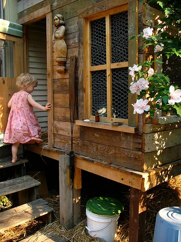
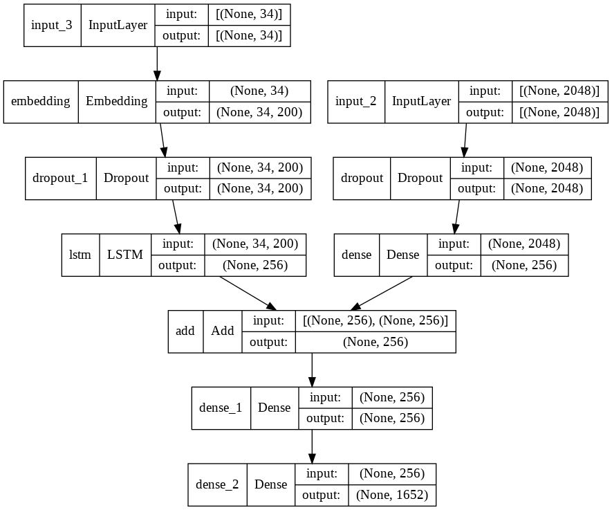

# Image Captioning with LSTM

Image Captioning model generates natural captions for input images

## Dataset
The model is trained on [Flickr8k Dataset](https://academictorrents.com/details/9dea07ba660a722ae1008c4c8afdd303b6f6e53b) which contains 8000 images. 6000 for training, 1000 for testing and validating.

Other dataset which larger observation like Flickr30k can also be used to train the model

After downloading, there are 2 folder **Flicker8k_Dataset** and **Flicker8k_Text**:
- Flicker8k_Dataset contains images with different id as its name
- Flicker8k_Text contains:
  - Flickr_8k.testImages, Flickr_8k.devImages, Flickr_8k.trainImages, Flickr_8k.devImages consist of image id for test, train and validation.
  - Flickr8k.token contain 5 different caption for each image in the *Flicker8k_Dataset*

Image | Caption
--- | ---
 | - A child in a pink dress is climbing up a set of stairs in an entry way. - A girl going into a wooden building . - A little girl climbing into a wooden playhouse . - A little girl climbing the stairs to her playhouse . - A little girl in a pink dress going into a wooden cabin 

## Model

    

## Performance

The model has been trained for 10 epoches on 6000 training samples of Flickr8k Dataset. It acheives a `BLEU-1 = ~0.56` with 1000 testing samples with both **Greedy Search** and **Beam Search**

----------------------------------

## Requirements
- tensorflow
- nltk
- numpy
- matplotlib
- pandas

## Architecture

**Input** of our model is the *image* and **Output** is a text correspoding to provided image
 
 As we have input is image, we can think about using CNN to extract the features from it, along with output is text, we immediately think about RNN which handles sequences and used Long Short-Term Memory in this case.

 For the training, for each 1 image, we have 5 captions combined together. So we have to pre-process these 2 input seperately before fit into our LSTM model. 
 
 With the captions, in general, most of Machine Learning or Deep Learning model does not handly text input like `'man', 'hawk', 'woman'..` directly and have to encode into number form. Each word will be encoded into a vector with fixed length (also call *word embedding*). For this project, I use Pre-trained GLOVE Model to vectorize words
