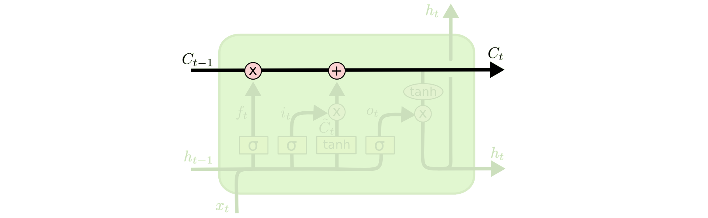

  
  # Image Captioning with LSTM

  Image Captioning model generates natural captions for input images
  
  ### Note:
  If you have hard time reading the math explain, consider change your github theme to light! Follow the path: Settings -> Appearance 
  
  ## Dataset
  The model is trained on [Flickr8k Dataset](https://academictorrents.com/details/9dea07ba660a722ae1008c4c8afdd303b6f6e53b) which contains 8000 images. 6000 for training, 1000 for testing and validating.

  Other dataset which larger observation like Flickr30k can also be used to train the model

  After downloading, there are 2 folder **Flicker8k_Dataset** and **Flicker8k_Text**:
  - Flicker8k_Dataset contains images with different id as its name
  - Flicker8k_Text contains:
    - Flickr_8k.testImages, Flickr_8k.devImages, Flickr_8k.trainImages, Flickr_8k.devImages consist of image id for test, train and validation.
    - Flickr8k.token contain 5 different caption for each image in the *Flicker8k_Dataset*

  Image | Caption
  --- | ---
   | - A child in a pink dress is climbing up a set of stairs in an entry way. - A girl going into a wooden building . - A little girl climbing into a wooden playhouse . - A little girl climbing the stairs to her playhouse . - A little girl in a pink dress going into a wooden cabin 

  ## Requirements
  - tensorflow
  - nltk
  - numpy
  - matplotlib
  - pandas

  These requirements can be easily installed by: `pip install -r requirements.txt`

  ## Model
  

      
  

  ## Performance

  The model has been trained for 10 epoches on 6000 training samples of Flickr8k Dataset. It acheives a `BLEU-1 = ~0.56` with 1000 testing samples with both **Greedy Search** and **Beam Search**

  ----------------------------------

  ## Architecture

  **Input** of our model is the *image* and **Output** is a text correspoding to provided image

   As we have input is image, we can think about using CNN to extract the features from it, along with output is text, we immediately think about RNN which handles sequences and used Long Short-Term Memory in this case.

   For the training, for each 1 image, we have 5 captions combined together. So we have to pre-process these 2 input seperately before fit into our LSTM model. 

   With the captions, in general, most of Machine Learning or Deep Learning model does not handly text input like `'man', 'hawk', 'woman'..` directly and have to encode into number form. Each word will be encoded into a vector with fixed length (also call *word embedding*). For this project, I use Pre-trained GLOVE Model to vectorize words, each vector has shape of `(1,200)`. Then we fit word vector into **RNN/LSTM** model to handle sequential data and predict which word is next in the sequence. The output vector of model is `(1,256)`

   With the images, similarly with text, we also use a pre-trained model with larget datasset (Imagenet) to extract features from images into a *featuring vector*. There are a lot of pre-trained model outhere likes: ResNet, VGG16, Inception,.. In this model, I chose to use the InceptionV3. As InceptionV3 requires input as shape `(299,299)`, we need to resize our image into that. The output vector is `(1,256)`

   ### Text processing

   Before vectorizing words into vector, we need to clean the captions with following steps:
   - Convert uppercase to lowercase, "Hello" -> "hello"
   - Remove special characters like "%", "$", "#"
   - Remove alphanumeric characters like hey199 

  Afterthat, we add 2 token `"startseq"` and `"endseq"` to denote the start and end of the caption. For example: “startseq a girl going into a wooden building endseq“. The *endseq* is used to know whether it is the end of the caption while testing.

  We see there are around 9000 different words out of 40000 captions. However, we don't care much for words that appear only a few times, because it looks like noise and is not good for our model's learning and prediction, so we keep only the words that appear more than **10 times**. among all the captions. After removing the words that appear less than 10 times, we are left with 1651 words. 

  ### Model Architecture

  As the image of model above, the left hand side is the input for Text, and the right hand side is for images. After preprocessing captions, embedded words to vector and extract features from images, we concatnate these 2 inputs and fit to our model. The idea here is that when we provided a embedding vector of image and a word, we will try to predict what will come next in the sequence.

  

      
    <figcaption>Image from Deep Learning cơ bản website - Image Captioning</figcaption>
  

  ## Math explain for Long Short-Term Memory

  Long Short Term Memory networks – usually just called "LSTMs" – are a special kind of RNN, capable of learning long-term dependencies. LSTMs are explicitly designed to avoid the long-term dependency problem. (You can read more about this problem as well as *vanishing gradient* [here](https://colah.github.io/posts/2015-08-Understanding-LSTMs/)

  

      
    <figcaption>The chain like structure of LSTM</figcaption>
  

  In comparision with traditional RNN model only has 1 layer which is activation function like `tanh` or `relu`, the LSTM model has 4 different layers interacting with each other in a special way.

  ### Cell State - Core idea of LSTM model

  The core idea behinds a LSTM model is a cell state, which is the horizontal line running through the top of a diagram. The cell state work like a conveyor belt, bringing the information flow through the structure with minor linear interaction. Like in this case, we only have 2 pointwise operation, multiplication and addition.

  

      
  

  If LSTM model want to remove or add information into the cell state, the passed information must go through a structure call **gates**.

  Gates are a way to optionally let information through. They are composed out of a sigmoid neural net layer and a pointwise multiplication operation. The sigmoid function output the numbers lie between 0 and 1, indicating how much of information should be let through the gate. The output of 0 means "let nothing pass" and output of 1 means "let everything through"

  LSTM has a total of 3 gates, protect and control the cell states: Forget gate, input gate and output gate.

  ### LSTM model walk-through

  

      
  

  Look from the left, the first step in LSTM model is deciding which information will get throw away. The mentioned forget gate with sigmoid function will make the decision in which information will be removed. It looks at  and  and outputs a number between 0 and 1 for each number in the previous cell state 
  
  The next step is to decide what new information we’re going to store in the cell state. This has two parts. First, a sigmoid layer called the *input gate layer* decides which values we’ll update. Next, a *tanh layer* creates a vector of new candidate values, , that could be added to the state. In the next step, we’ll combine these two to create an update to the state.

 

      

We are now going to update the old cell state , into the new cell state . After forgetting the things we decided to forget earlier by multiply , we then add  as new candidate values, scaled by how much we decided to update each state value.

 

      

Finally, we need to decide what we’re going to output. This output will be based on our cell state, but will be a filtered version. First, we run a sigmoid layer which decides what parts of the cell state we’re going to output. Then, we put the cell state through *tanh* (to push the values to be between −1 and 1) and multiply it by the output of the sigmoid gate, so that we only output the parts we decided to.

 

      

## Usage

Open Jupyter Notebook in Google Collab and follow step-by-step to produce and test the model. You can also jump to the testing part with pre-trained model save in folder `saved_model` which contains 2 files: 1 with vocabulary for words appear more than 10, and once fore appear more than 7.

## References 

[1] Nguyễn Thanh Tuấn. [Deep Learning cơ bản](https://drive.google.com/file/d/1lNjzISABdoc7SRq8tg-xkCRRZRABPCKi/view)
[2] Christopher Olah. [Understanding LSTM Networks](https://colah.github.io/posts/2015-08-Understanding-LSTMs/)

----------------------------------
